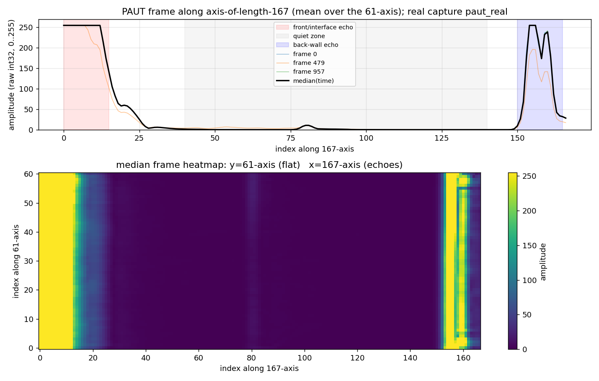
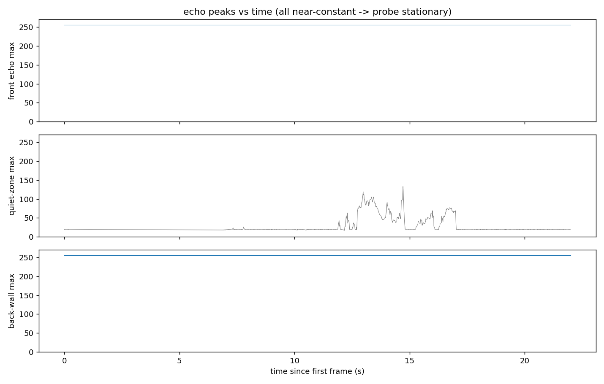

# PAUT 相控阵超声采集测试报告

- **采集时间**：2026-09-04（真机，超声数据经 Wi-Fi 由设备 UDP 推流至采集主机）
- **数据**：`tank_inspection_ws/bags/paut_real`（`.mcap`，Zstd 压缩）
- **模块**：本工作区新增 `paut_driver`（UDP 接收/解码）→ `/inspection/paut/raw`（`inspection_interfaces/msg/PautFrame`，int32 保真）→ `ros2 bag record --storage mcap`
- **文档附图**：本目录 `paut_a_scan_heatmap.png`、`paut_echo_vs_time.png`

---

## 1. 采集背景与数据链路

设备端把相控阵超声一帧按如下格式经 UDP 发往采集主机 **12345** 端口：

```
int32 height + int32 width + height×width 个 int32（行优先，host-endian）
实测：height=61，width=167；单帧 ≈ 40.7 KB（一个数据报一帧）
```

采集主机侧新驱动 `paut_driver_node`：
1. 收 UDP 数据报 → 校验（维度有界、`n == 8 + height×width×4`）；
2. 转成 channel-major 布局（`samples[channel*sample_count + sample]`）；
3. 填 header（`stamp` = 主机收包完成时刻，设备无硬件时戳；`sensor_id`/`calibration_id` 等来自参数）；
4. 发布 `inspection_interfaces/msg/PautFrame`（`int32[] samples` 保真、不做滤波/增益/归一化）到 `/inspection/paut/raw`（best_effort）；
5. 每秒上报一次 `/diagnostics`（parsed / garbage / rate / 维度），供健康监测。

录制由既有 `record_only`（`ros2 bag record --storage mcap` + `mcap_writer_options.yaml`：**Zstd、4 MiB 分块**）完成，`record_topics.yaml` 已含 `/inspection/paut/raw`。

---

## 2. 采集方法 / 操作流程

**准备（网络 / 进程）**
1. 设备与采集主机处于**同一网段**（本次经 Wi-Fi）。设备将帧发往**主机 IP 的 UDP 12345**（或同网段广播；驱动已开 `SO_BROADCAST` 并监听 `0.0.0.0:12345`）。
2. 确认 **12345 只有一个进程占用**——PAUT_ros2 的 `paaut_control` 或残留的 `paut_driver_node` 都必须停掉，否则新节点 `bind` 失败（本次采集就因此出现过一次，见 §6 注意事项）。

**启动（两个终端，均在 `tank_inspection_ws` 下）**
```bash
# 终端 1：驱动（带参数便于溯源）
export PATH=/usr/bin:$PATH
source /opt/ros/jazzy/setup.bash && source install/setup.bash
ros2 run paut_driver paut_driver_node --ros-args \
  -p port:=12345 -p sensor_id:=paut-001 -p frame_id:=paut_probe_link

# 终端 2：采集 + 录 mcap（capture_seconds:=0 表示手动 Ctrl-C 结束）
export PATH=/usr/bin:$PATH
source /opt/ros/jazzy/setup.bash && source install/setup.bash
ros2 launch inspection_bringup paut_capture.launch.py \
    capture_seconds:=0 sensor_id:=paut-001 \
    output_directory:=bags/paut_real
```
> 用 `paut_capture.launch.py` 时**不需要**再单独 `ros2 run`（launch 里已带驱动节点）。本报告数据因当时存在一个残留节点、launch 内节点 bind 失败，详见 §6。

**结束与核对**
```bash
# 终端 2 按 Ctrl-C 正常停机后：
ros2 bag info bags/paut_real
# 应看到: /inspection/paut/raw  type: inspection_interfaces/msg/PautFrame  messages > 0
```

**无真机时的冒烟验证**：用合成推流源 `python3 scripts/send_paut_frames.py 12345 50` 替代设备侧，其余步骤相同。

---

## 3. 采集结果

`ros2 bag info bags/paut_real` 摘要：

| 项目 | 数值 |
|---|---|
| 存储格式 / 压缩 | mcap，Zstd |
| bag 大小 | 4.0 MiB |
| 时长 | 21.98 s |
| `/inspection/paut/raw` 帧数 | **958** |
| 消息类型 | `inspection_interfaces/msg/PautFrame` |
| `/diagnostics` | 44 条 |
| 有效帧率（录制窗内） | ≈ **43.5 Hz**（958 / 21.98 s） |
| 每帧结构 | `channel_count=167, sample_count=61`，`samples` 长度 10187 |
| 样本类型 / 编码 | `int32[]`，`signed_int32_host_endian_channel_major` |
| 帧序号 | 单调连续（sequence 无缺号） |
| 设备侧健康诊断（真发布节点） | `parsed_frame_count` 窗口内 ≈+937；`garbage_datagram_count=0`；瞬时速率 EWMA 曾达 ~358 Hz（突发） |
| `sensor_id` | `paut-001`（`calibration_id` 未填，为 `UNASSIGNED`） |

> 说明：真发布节点的 `parsed` 为累计值，采集前已运行一段；录制窗内新增 ≈937，与 bag 内 958 帧一致，说明**录制期间设备帧基本都被完整写入**。

---

## 4. 结果分析

### 4.1 链路正确性（解码 / 录制无损）
- 类型、维度、长度、编码均与定义一致；`sequence` 单调 → UDP→解码→发布→mcap 全链路正确。
- 设备侧 `garbage_datagram_count=0` → 收到的是"一帧一数据报、height/width 头正确"的完整帧，无分片/畸形。
- 该数据高度可压（大量 0 与恒定值），Zstd 压缩约 9–10×。

### 4.2 信号内容（逐帧语义）
每帧是相控阵的一幅 2D 阵列，但本次内容呈现强 1D 特征。取中位数帧分析：

- **整体分布**：min 0，max 255，mean≈39，约 9.5% 样本 = 255，中位数≈1。
- **沿 167 轴呈典型 A 扫形态**（三段）：

| 区段 | 位置 | 行为 | 解释 |
|---|---|---|---|
| 前端回波 | 通道 0–15 | ≈255（饱和） | 界面 / 近场强回波，AGC 顶到 255 |
| 安静区 | 通道 40–140 | ≈0 | 声程中段无回波（本次未出现内部缺陷回波） |
| 后端回波 | 通道 150–165 | 峰值≈255 | 底波（板底/背面回波） |

- **61 轴近乎恒定**（标准差 ≈5）：两轴间几乎无独立信息，画面≈"同一 A 扫沿 167 轴、被 61 行复制"。
- **时间维静止**：首帧与末帧波形相关性 **0.999**；前端/底波峰值全程恒定 255 → 本次为**静置平板/试块、探头未扫查**的基线画面，958 帧近乎同一画面重复。
- 255 为**饱和的强回波**，不是坏点/噪声。

### 4.3 图





### 4.4 待确认项（影响后续使用，建议做一次物理验证）
- **轴方向**：回波（时间）结构出现在 **167 轴**，而 `.msg` 注释将 167 记为“channel=扫描位置、61=深度”。若设备 B 扫实际为“61 条 A 线 × 167 深度采样”，则 167 才是时间/深度轴、61 是扫描线，与注释相反。**建议**：探头扫过缺陷/台阶，观察回波沿哪根轴移动，据此确认/修正轴语义（必要时调整 `.msg` 注释与后续对齐逻辑）。
- **扫查场景**：若目标是在线扫描，应录到每帧随位置变化的 2D 结构；本次为静态基线，暂无法评估“扫过缺陷时的 B 扫形态”。

---

## 5. 存储情况分析

| 口径 | 数值 | 备注 |
|---|---|---|
| 本包实测大小 | **4.0 MiB**（22 s / 958 帧） | 含 44 条 diagnostics |
| 每帧原始负载 | ≈ **40.7 KB**（167×61×4 B） | 未压缩 int32 |
| 每帧平均落盘 | ≈ **4.3 KB/帧** | Zstd，本包内容极规则、压缩 ~9–10× |
| 落盘速率（本包） | ≈ 0.18 MB/s ≈ **0.65 GB/小时** | 按 43.5 Hz、当前静置画面 |
| 若按原始流存储 | ≈ 1.77 MB/s ≈ **6.4 GB/小时** | 未压缩上界 |
| 真机扫查场景预估 | **≈ 1–3 GB/小时** | 有回波变化/噪声时压缩率下降，建议按 ~2 GB/h 预留 |

**分卷策略**（`record_topics.yaml`，按 `debug_mode` 选择）：
- `production`：**10 GB / 900 s** 一卷；
- `debug`：**200 MB / 30 s** 一卷。

**结论与建议**：超声单路在 mcap+Zstd 下长期占比很低（远小于相机/点云各路）。跑完整扫描前按 **每路 ~2 GB/小时 × 计划时长 + 相机/激光占用**预留磁盘即可；若在意吞吐，可调大 `qos_overrides.yaml` 中 `/inspection/paut/raw` 的 `depth`（现为 100）以降低突发丢帧概率。

---

## 6. 本次采集遇到的问题与改进

1. **双节点端口冲突**：采集前有一个残留 `paut_driver_node` 占用了 12345，导致 `paut_capture.launch.py` 内的驱动节点 `bind` 失败（errno=98 Address already in use）；bag 中 `/diagnostics` 因而混入了该失败节点的 ERROR 统计（parsed=0）与真发布节点的统计。**改进**：采集前 `pkill -f paut_driver_node`，只保留 launch 内一个节点；后续可按 §2 命令重采一次以得到干净的 diagnostics。
2. **`ros2 topic echo/hz` 曾报 “The message type ... is invalid”**：根因是 CLI 所在 shell 的 `python3` 为 anaconda(3.7)，加载不了 ROS Jazzy 的 python3.12 消息绑定。**改进**：`export PATH=/usr/bin:$PATH` 后再执行（§2 已含）。
3. **待填标定**：本次 `calibration_id=UNASSIGNED`、`sampling_rate_hz=0`、`gain_db/sound_velocity_m_s=NaN`。真机正式采集应按设备手册填 `calibration_id / sampling_rate_hz / gain_db / sound_velocity_m_s`，否则数据不可作定量后处理基线（驱动已按“未标定不标记为标定数据”处理）。

---

*附图与数据文件位置：本报告与两张 PNG 位于 `reports/paut_real_analysis/`；原始数据在 `bags/paut_real`。*
